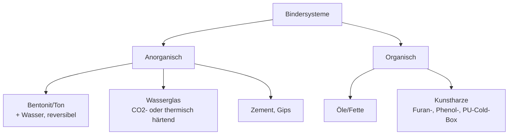

# Binder

> Quellen: [Q13] Anorganische Bindersysteme; [Q14] Wasserglas-CO₂-Verfahren; [Q3] Fachbuch anorganische Binder; [Q4] Bentonit-Praxishandbuch.

## Klassifikation



## Bewertung für das Projekt

| Binder | Härtung | Festigkeit | Regenerierbarkeit | Arbeitsschutz | Kosten | Eignung |
|---|---|---|---|---|---|---|
| Bentonit + Wasser | keine (plastisch) | mittel | **sehr gut** (Wasser nachdosieren) | unkritisch | sehr gering | Form: **hoch** |
| Öl (fertiger Ölsand) | keine | mittel | gut | unkritisch (Rauch beim Guss) | gering | Form: **hoch**, ideal für Studierendenbetrieb |
| Wasserglas + CO₂ | Begasung, s bis min bei RT [Q14] | hoch | eingeschränkt | unkritisch (CO₂-Lüftung beachten) | gering | Kern: **hoch** |
| PU-Cold-Box / Furanharz | Katalysator/Amin | sehr hoch | schlecht | Dämpfe, Absaugung nötig | hoch | **niedrig** (Overkill, Sicherheitsaufwand) |

## Wasserglas-CO₂-Verfahren (Kern-Favorit) [Q14]

Alkalisilikat (Wasserglas, Na₂O·nSiO₂) wird dem Sand zugemischt (typ. 2–4 Ma.-% [Fachwissen – Quelle nachtragen]); Begasung mit CO₂ fällt Silikagel aus und verfestigt den Kern:

```
Na2O·nSiO2·xH2O + CO2 → Na2CO3 + n SiO2·xH2O (Gel)
```

Historie: erstes Cold-Box-Verfahren, Petrzela 1947 [Q14]. Vorteile: Aushärtung bei Raumtemperatur in Sekunden bis Minuten, umweltfreundlich [Q14]. Nachteil: schlechterer Kernzerfall — bei unseren niedrigen Gießtemperaturen bleibt der Kern kaum thermisch geschädigt → **Zerfall im Vorversuch explizit testen** (evtl. mechanisch ausbrechbar gestalten oder Zuckerzusatz zur Zerfallsverbesserung [Fachwissen – Quelle nachtragen]).

**Praxisnotiz:** CO₂ ggf. aus Sodastream-/Schweißgas-Flasche mit Druckminderer; Begasungslanze aus Rohr selbst bauen. Alternative ohne Gas: wasserglasgebundene Kerne im Ofen bei ~150–200 °C trocknen (thermische Härtung) [Fachwissen – Quelle nachtragen].

## Stand nach E4 (04.07.2026)

**Form: entschieden** — Speiseöl als Binder im Vogelsand (Rezeptur über V-F1, → `formsand.md`).

**Kern: offen (F12)** — zwei Kandidaten:

| Kriterium | Gebackener Ölsandkern | Wasserglas-CO₂ |
|---|---|---|
| Konsistenz zum Formsand | **identisches Materialsystem** (Vogelsand + Öl) → ein Sandkreislauf | zweites Bindersystem im Labor |
| Härtung | Backen im **vorhandenen Nabertherm-Ofen** (~180–220 °C bis Verfestigung [Fachwissen – V-K1]) | CO₂-Flasche + Begasungslanze nötig |
| Festigkeit | mäßig — für Kern Ø 14 × 50 mm voraussichtlich ausreichend | hoch |
| Zerfall/Entkernen | gut | schlechter (bei 280 °C kaum thermische Schädigung) |
| Nachhaltigkeit/Budget | sehr gut | Gasbeschaffung |

**Empfehlung:** Gebackener Ölsandkern zuerst testen (V-K1) — nutzt Ofen und Sandkreislauf, kein Zusatzsystem. Wasserglas-CO₂ nur, falls Festigkeit/Maßhaltigkeit nicht reicht. Hinweis: Leinölfirnis statt Speiseöl verbessert die Aushärtung (oxidativ trocknendes Öl — klassischer Kernölansatz [Fachwissen – Quelle nachtragen]).

- [ ] V-K1 entsprechend umplanen (→ `kernherstellung.md`)
- [ ] Entscheidung nach V-K1 in `entscheidungen.md` E4/F12 nachtragen
