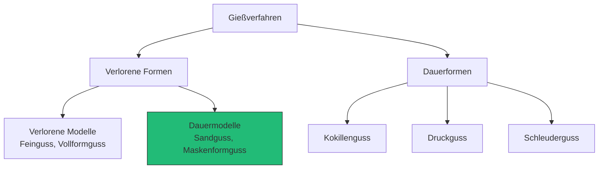
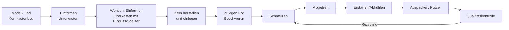

# Gießverfahren (Urformen durch Gießen)

> Quellen: [Q1] Fritz: Fertigungstechnik; [Q6] [Q7] Gießereilexikon. Aussagen ohne Tag = [Fachwissen – Quelle nachtragen, gegen Q1 prüfen].

## Definition

**Urformen** ist nach DIN 8580 das Fertigen eines festen Körpers aus formlosem Stoff durch Schaffen des Zusammenhalts. Gießen ist Urformen aus dem flüssigen Zustand.

**Merksatz:** Gießen ermöglicht endkonturnahe Fertigung komplexer Geometrien (inkl. Innenkonturen durch Kerne) bei hoher Materialausnutzung – genau die Begründung aus der Aufgabenstellung.

## Klassifikation



Für das Projekt relevant: **Sandguss mit verlorener Form und Dauermodell** [Q6]. Bentonitgebundener Formstoff deckt ca. 70 % der Fertigung mit verlorenen Formen ab [Q6].

## Prozesskette Handformverfahren (Projektprozess)



## Elemente des Gießsystems

| Element | Funktion | Gestaltungshinweis |
|---|---|---|
| Eingusstrichter | Aufnahme der Schmelze | Ausreichend groß für kontinuierliches Gießen |
| Gießlauf/Anschnitt | Führung der Schmelze in den Formhohlraum | Turbulenzarm, keine Sanderosion |
| Speiser | Nachspeisung des Erstarrungsvolumendefizits | Muss zuletzt erstarren (→ `schwindung.md`) |
| Windpfeife/Entlüftung | Abführen von Luft und Formgasen | Am höchsten Punkt des Hohlraums |
| Kern | Abbildung der Innenkontur | Kernlager im Modell vorsehen (→ `kernherstellung.md`) |

## Formeln

Erstarrungszeit nach Chvorinov (Auslegung Speiser vs. Bauteil):

```
t_E = k · (V/A)²     [t_E] = s
V = Volumen des Gussteils/Speisers [m³]
A = wärmeabgebende Oberfläche [m²]
k = Formstoffkonstante [s/m²] (werkstoff- und formstoffabhängig)
Bedingung: (V/A)_Speiser > (V/A)_Bauteil
```

[Fachwissen – Quelle nachtragen; Herleitung in Q1, Kap. Urformen]

## Verfahrensauswahl für den Laborversuch

| Kriterium | Handformen (Grünsand) | Handformen (chem. gebunden) | Kokille |
|---|---|---|---|
| Investition | sehr gering | gering | hoch (Fertigung Kokille) |
| Wiederholbarkeit durch Studierende | gut | gut | sehr gut |
| Lerninhalt Formherstellung | **vollständig** | vollständig | entfällt |
| Kern möglich | ja | ja | ja, aufwendig |
| Zeit pro Durchlauf | mittel | mittel (Aushärtezeit!) | kurz |
| Passung zur Aufgabenstellung (Form aus Ober-/Unterkasten, Kernkasten) | **erfüllt** | erfüllt | nicht erfüllt |

**Empfehlung:** Handformverfahren im zweiteiligen Formkasten. Begründung: explizit durch Aufgabenstellung gefordert (A4), geringste Kosten, maximaler Lerninhalt. Binderwahl → `binder.md`, Entscheidung offen bis Vorversuche (→ `entscheidungen.md`).
