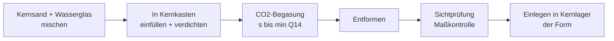

# Kernherstellung

> Quellen: [Q13] [Q14] Bindersysteme/Wasserglas-CO₂; Rest [Fachwissen – Q1/Q3 prüfen].

## Funktion des Kerns

Der Kern bildet die **Innenkontur** des Gussteils ab (Hohlräume, Hinterschneidungen), die das Modell nicht abbilden kann. Die Aufgabenstellung fordert **mindestens einen Kern** (A3) → der Kern ist zentrales Konstruktionselement des Bauteils.

## Anforderungen an den Kern

| Anforderung | Begründung | Maßnahme |
|---|---|---|
| Festigkeit | übersteht Handling + Einlegen + Auftrieb der Schmelze | chemisch gebundener Sand (Wasserglas-CO₂ [Q14]) |
| Maßhaltigkeit | Innenkontur = Funktionskontur | präziser Kernkasten (→ `kernkasten.md`) |
| Gasdurchlässigkeit | Kerngase müssen entweichen | grober Sand, ggf. Entlüftungskanal durch Kernlager |
| Zerfall nach Guss | Entkernen ohne Bauteilschaden | Bindergehalt minimieren; Zerfall im Vorversuch testen |
| Lagerung im Kernlager | Position + Auftriebssicherung | Kernmarken beidseitig, ausreichende Auflagefläche |

## Kräftebetrachtung Kernauftrieb

```
F_A = ρ_Schmelze · g · V_verdrängt − ρ_Kern · g · V_Kern
Sn-Bi: ρ ≈ 8,5…8,7 g/cm³ [Q22, prüfen]  → Auftrieb erheblich,
       da ρ_Kernsand ≈ 1,6 g/cm³
→ Kernlager auf Flächenpressung prüfen, ggf. Kern beidseitig lagern
```

Rechnung nach Bauteilentwurf konkret durchführen (Berechnungsdokument im Bericht).

## Prozess (geplant)



## Vorversuch V-K1 (Checkliste — aktualisiert nach E4: Favorit gebackener Ölsandkern)

- [ ] **Primär:** Kerne aus Vogelsand + Speiseöl bzw. Leinölfirnis im Kernkasten formen, im Nabertherm-Ofen backen (Temperatur-/Zeitreihe, z. B. 180/200/220 °C × 30/60 min)
- [ ] Festigkeit: Bruchprobe + Handlingtest (übersteht Einlegen?)
- [ ] Maßhaltigkeit gegen Kernkasten messen (Kern Ø 14, → `bauteil_konzept.md`)
- [ ] Probeabguss: Kern übersteht Umgießen mit Sn bei 280 °C? Auftrieb? Gasung?
- [ ] Kernzerfall/Entkernbarkeit nach Guss bewerten
- [ ] **Rückfallebene:** Wasserglas-CO₂ (Anteil 2/3/4 Ma.-%, Begasungsdauer variieren) nur bei Scheitern des Ölsandkerns
